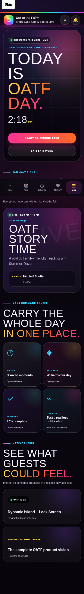
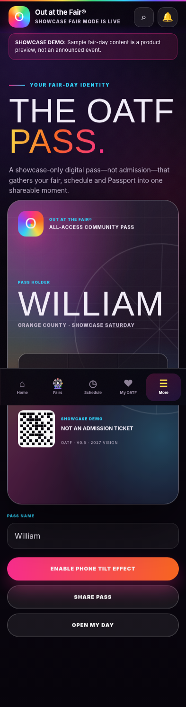

# Out at the Fair® App — V0.5 Showcase Edition

A mobile-first Out at the Fair® fair-day companion built as an installable PWA and a Capacitor-ready iOS/Android project.

V0.5 is the final showcase build: it demonstrates the full guest journey before, during and after a fair while keeping all sample event content clearly labeled as a demo.

## V0.5 showcase features

- Cinematic OATF launch sequence
- One-tap **Showcase Fair Mode**
- Guided 60-second presentation
- Happening Now and Up Next dashboard
- Real native local demo notification scheduled ten seconds ahead
- Animated, personalized OATF Pass with tilt effect
- My Day fair timeline with a Caleb-and-Daniel meet-up moment
- OATF Passport completion celebration with confetti and haptics
- Dynamic Island and Lock Screen concept preview
- Future-of-OATF finale: before, during and after the fair
- All V0.4 schedules, maps, accessibility, community, planner, favorites and offline support

## Preview

<table>
<tr>
<td></td>
<td></td>
</tr>
</table>

## Open V0.5 in Xcode

Download the full ZIP into Downloads, then paste the entire block below into Terminal:

```bash
ZIP="$(find "$HOME/Downloads" -maxdepth 1 -type f -name 'outatthefair-app-v0.5*.zip' ! -name '*github-upload*' -print0 | xargs -0 ls -t 2>/dev/null | head -n 1)"

if [ -z "$ZIP" ]; then
  echo "V0.5 ZIP not found in Downloads. Download the full V0.5 ZIP first."
  exit 1
fi

rm -rf "$HOME/Downloads/outatthefair-app-v0.5"
unzip -q "$ZIP" -d "$HOME/Downloads"
cd "$HOME/Downloads/outatthefair-app-v0.5"

rm -f capacitor.config.ts
npm install

if [ -d ios ]; then
  npx cap sync ios
else
  npx cap add ios
  npx cap sync ios
fi

npx cap open ios
```

Do not run `npm audit fix --force` just to open the project.

## GitHub Pages upload

Use the separate `outatthefair-app-v0.5-github-upload.zip`. It intentionally excludes `.github`, so the working Pages workflow already in the repository remains untouched.

Upload the contents at the repository root and commit to `main`.

## App identity

- App name: `Out at the Fair`
- Bundle identifier: `com.outatinc.outatthefair`
- Version: `0.5.0`
- Web directory: `www`

## Important demo note

LA County and Orange County showcase content is sample product-demo material and does not announce a confirmed event. The animated OATF Pass is not an admission ticket.

© OutAt Inc. Out at the Fair® is a registered brand of OutAt Inc.
