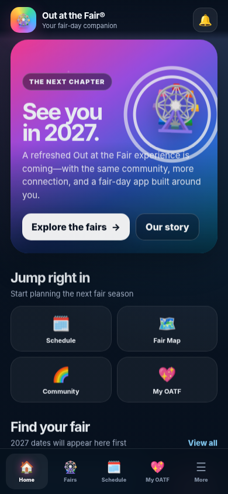
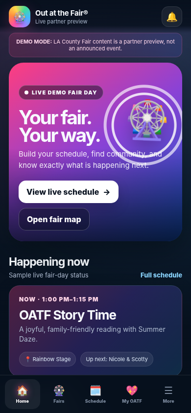

# Out at the Fair® App — V0.1

A mobile-first Out at the Fair® fair-day companion built as an installable PWA and a Capacitor-ready iOS/Android project foundation.


## Preview

<table>
<tr>
<td></td>
<td></td>
</tr>
</table>

## What is included

- 2027 holding experience for San Diego, Orange County, and Riverside County fairs
- Clearly labeled **LA County Fair partner demo mode** (not a public event announcement)
- Fair selector and locally saved home fair
- Live demo schedule with Happening Now / Up Next states
- My OATF favorites and downloadable `.ics` calendar files
- Performer profiles and searchable community directory
- Interactive proof-of-concept fair map
- Accessibility guide
- Notification preferences and browser permission test
- OATF Passport demo with locally saved stamps
- Offline PWA caching
- App install/share controls
- GitHub Pages deployment workflow
- Capacitor configuration for future native iOS and Android builds

## Fastest GitHub upload

1. Create a new GitHub repository named `outatthefair-app`.
2. Unzip this package.
3. Upload **the contents inside the folder** to the repository root—not the outer folder itself.
4. Commit to `main`.
5. Open **Settings → Pages**.
6. Under **Build and deployment**, choose **GitHub Actions**.
7. The included workflow publishes the `www` folder.

Your preview URL will be similar to:

`https://YOUR-GITHUB-NAME.github.io/outatthefair-app/`

## Test locally without installing anything

From the repository folder:

```bash
python3 -m http.server 4173 --directory www
```

Then open:

`http://localhost:4173`

Do not open `www/index.html` directly as a file. Service workers and some browser features require a local server or HTTPS.

## Create the native iOS project

Capacitor 8 requires Node.js 22 or later and a current supported Xcode version.

```bash
npm install
npx cap add ios
npx cap sync ios
npx cap open ios
```

A double-click Mac helper is also included:

`SETUP-MAC.command`

The generated `ios/` folder should be committed to GitHub after it has been created successfully on the Mac.

## Updating content

Most content is in one file:

`www/assets/data.js`

Use it to update:

- Fairs and 2027 dates
- Stages, addresses, ticket links, and directions
- Performers and bios
- Entertainment schedule
- Community organizations and booth numbers
- Map pins
- History timeline

See `docs/CONTENT-UPDATE-GUIDE.md`.

## Important V0.1 notes

- The included app icon is an original **temporary V0.1 icon**, not a replacement for the official OATF logo/unicorn. Replace it before App Store submission.
- LA County Fair partner-demo content is intentionally labeled as a demonstration and does not announce a confirmed event.
- Favorites, settings, and passport progress are stored locally on the device.
- Remote push notifications, remote schedule editing, QR validation, user accounts, and an admin dashboard are planned for later releases.
- The sample calendar uses a placeholder 2027 date solely to demonstrate calendar export.

## Project structure

```text
outatthefair-app/
├── www/                       Static PWA used by GitHub Pages and Capacitor
│   ├── assets/data.js         Editable app content
│   ├── assets/app.js          App behavior and routing
│   ├── assets/styles.css      Complete visual system
│   ├── icons/                 Temporary PWA/App icon set
│   ├── index.html
│   ├── manifest.webmanifest
│   └── sw.js                  Offline cache
├── .github/workflows/         GitHub Pages deployment
├── capacitor.config.ts        Native app configuration
├── package.json               Capacitor dependencies and commands
├── SETUP-MAC.command          Native iOS setup helper
└── docs/                      Setup and editing guides
```

## App identity

- App name: `Out at the Fair`
- Bundle identifier: `com.outatinc.outatthefair`
- Version: `0.1.0`
- Web directory: `www`

© OutAt Inc. Out at the Fair® is a registered brand of OutAt Inc.
